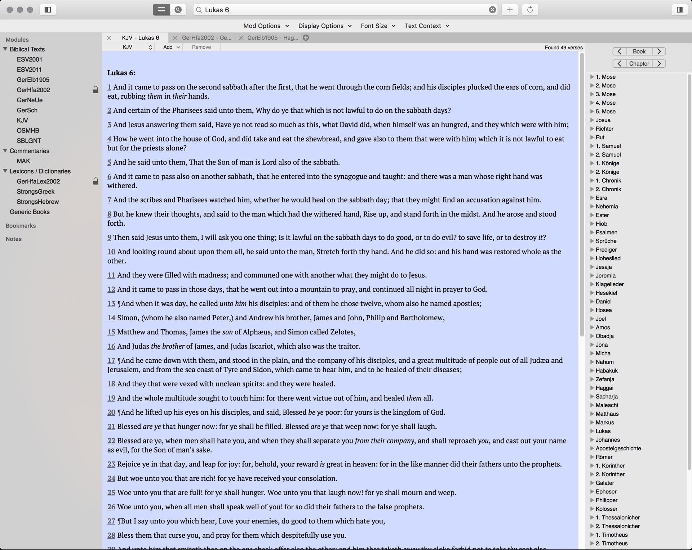
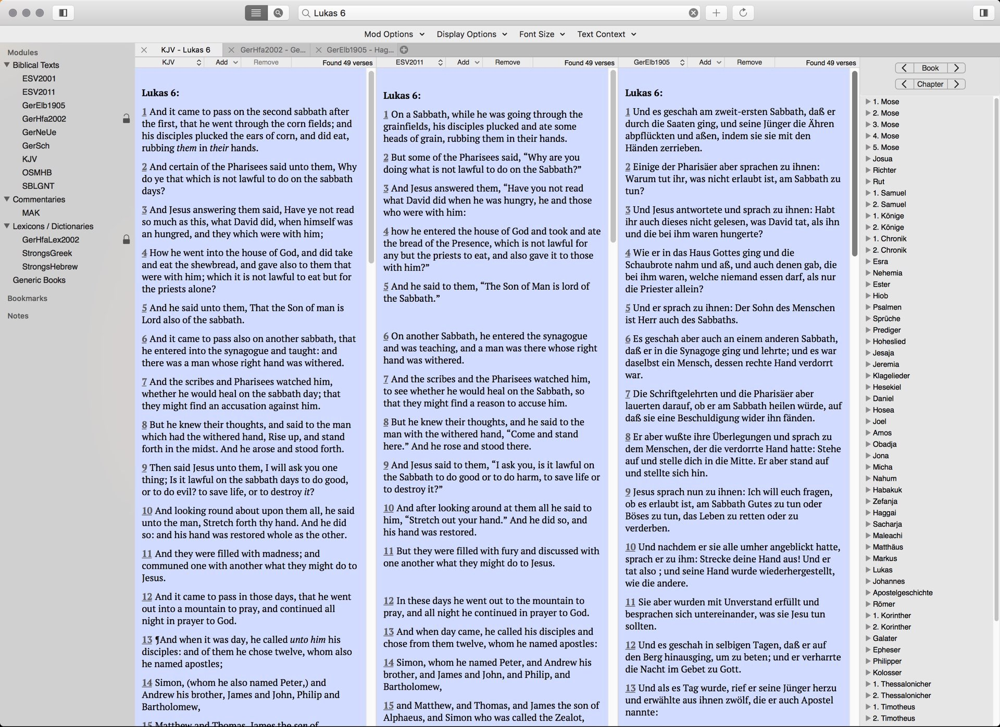
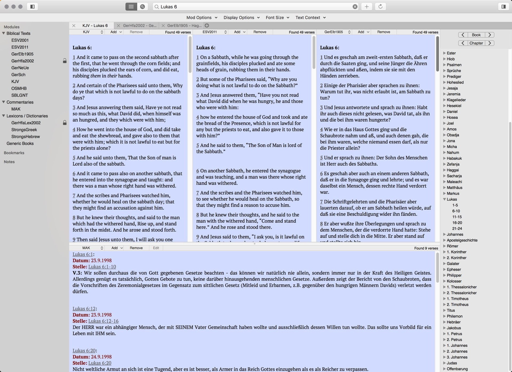

# Eloquent

Eloquent is a free & open-source application for research and study of God and His Word. It is developed specifically for Macintosh computers running macOS.

Eloquent allows you to read and browse many different bibles translations in different languages from Hebrew to Albanian. As well as reading devotionals, commentaries, dictionaries and lexicons, it also supports searching and advanced features such as services so that you can access the Bible in any program.

And because Eloquent is based on the [Sword project](https://crosswire.org/sword/index.jsp), it is compatible with an uncountable number of texts that are available via the built-in module manager in over 50 languages.

# Download releases
Releases can be downloaded under this link:
https://github.com/mdbergmann/Eloquent/releases

# Screenshots

Single bible text tab

Tripple bible text tab

Tripple bibtel text with commentary tab

